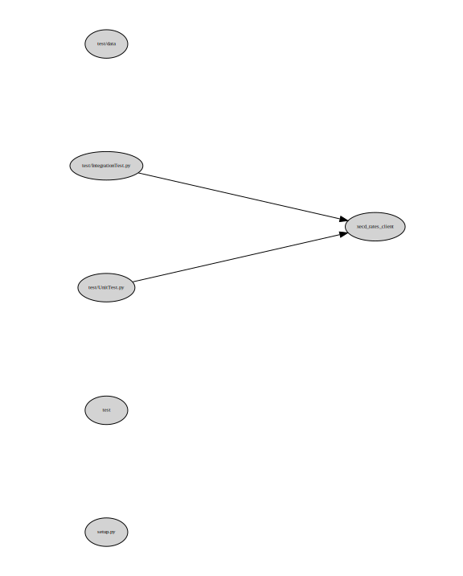

.. xecd_rates_client documentation master file, created by
   sphinx-quickstart on Mon Jul 23 22:03:35 2018.
   You can adapt this file completely to your liking, but it should at least
   contain the root `toctree` directive.

.. toctree::
   :maxdepth: 2
   :caption: Contents:

.. include:: ../../README.rst

Indices and tables
==================

* :ref:`genindex`
* :ref:`modindex`
* :ref:`search`

Project Schema
==============

